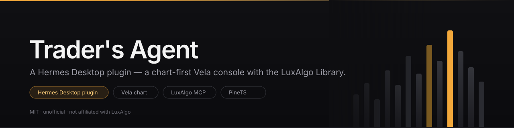
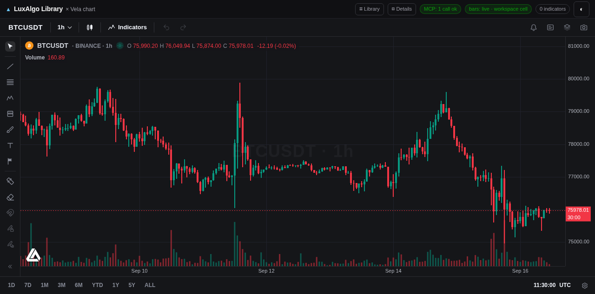
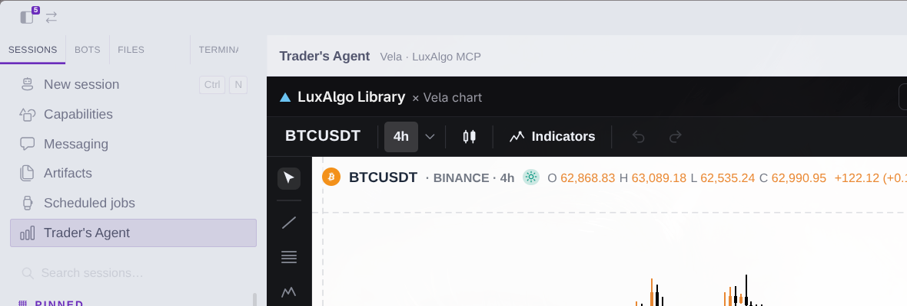
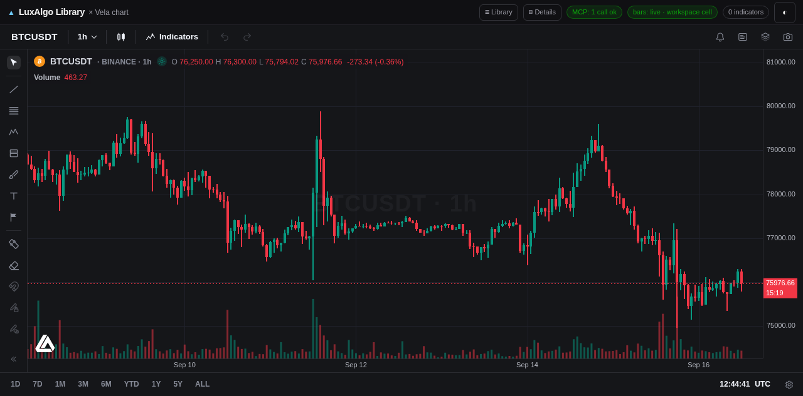
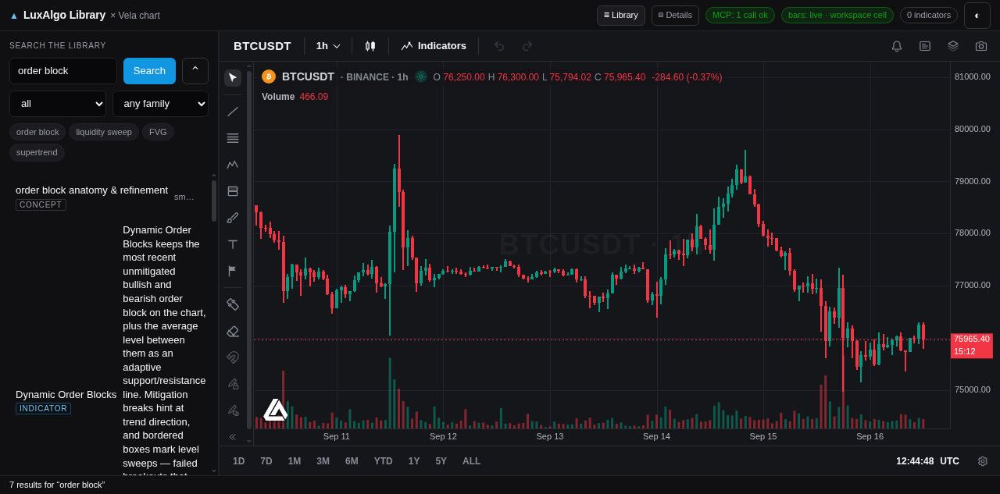
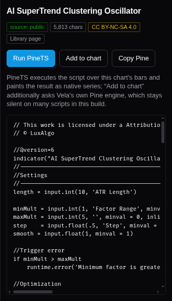

<div align="center">



**A Hermes Desktop plugin that opens a chart-first trading console: Vela-rendered candlesticks, and the LuxAlgo Library on top of them.**




</div>

A sidebar entry that opens a full trading console in the main zone: **Vela**-rendered candlesticks and
the **LuxAlgo Library** (800+ concepts and indicators, served live by LuxAlgo's own MCP server) in one
local web app.

- **Chart-first by design.** Vela gets the whole pane. The Library and the item detail panel are two
  small toggles in the top bar, never permanent columns.
- **Everything local.** One Python process on `127.0.0.1:8787` proxies LuxAlgo's MCP server and
  serves the frontend. No account, no key, no telemetry. Nothing from LuxAlgo is copied into this
  repo — the chart engine and the Pine runtime load from their published jsDelivr builds.
- **The agent can drive the chart.** `console/bin/trader-chart` reads what the chart is showing and
  puts indicator scripts on it through a small file bridge, so you prompt your agent instead of
  clicking around. `console/bin/library-indicator` pulls an indicator's Pine source by name.

> **Unofficial.** This project is not affiliated with, endorsed by, or sponsored by LuxAlgo. It uses
> the LuxAlgo name descriptively ("compatible with LuxAlgo MCP") and ships no LuxAlgo logo. See
> [`THIRD-PARTY.md`](THIRD-PARTY.md) for the licences and the attribution each piece requires.

## Requirements

| | |
|---|---|
| **Hermes Desktop** | v0.21.3 or newer (the plugin uses the `sidebar.nav` + `routes` contribution areas) |
| **Python** | 3.11+ with the `mcp` client: `pip install mcp` (a venv is fine — point `PY=` at it) |
| **Network** | for LuxAlgo's MCP endpoint and the jsDelivr builds; the chart falls back to synthetic bars when the data provider is unreachable |
| **OS** | Linux — built and verified on Omarchy (Arch + Hyprland). macOS and Windows are out of scope. |

## Install

```bash
git clone https://github.com/godzillacode0000/tradersagent-plugin
cd tradersagent-plugin

./console/start.sh        # terminal 1 — the console on http://127.0.0.1:8787/
./install.sh              # the plugin -> ~/.hermes/desktop-plugins/traders-desk/
                          #   and the desk skill -> ~/.hermes/skills/trading/trader-desk/
```

Then in Hermes Desktop:

1. `Ctrl+K` → **Reload desktop plugins**
2. **Capabilities → Plugins** → enable **Trading Desk**
3. Click **Trader's Agent** in the left sidebar — the console opens in the main zone

`./install.sh --vendor` additionally fetches LuxAlgo's pinned browser builds into
`console/frontend/vendor/` for offline use (see the licence note in `THIRD-PARTY.md`).

### Verify it worked

```bash
curl -s localhost:8787/api/health                    # {"ok": true, "data": {"status": "ok", ...}}
node tools/verify-plugin.mjs plugin/plugin.js        # OK — 8 contributions
console/bin/trader-chart state                       # symbol, timeframe, price, bars, indicators on
```

Then, in the app: the **Trader's Agent** row is in the left sidebar, the console frame shows Vela
bars with the `▲` mark, and the status-bar chip reads **Trader's Agent**. If the frame is blank, the
console process is not running — start it again.

### Run the console as a service (optional)

```ini
# ~/.config/systemd/user/traders-agent.service
[Unit]
Description=Trader's Agent console (LuxAlgo MCP proxy + Vela chart)
After=network-online.target

[Service]
ExecStart=%h/tradersagent-plugin/console/start.sh
Restart=always
WorkingDirectory=%h/tradersagent-plugin

[Install]
WantedBy=default.target
```

```bash
systemctl --user enable --now traders-agent.service
```

## Using it

| Where | What it does |
|---|---|
| Left sidebar → **Trader's Agent** | reveals the chart pane and brings the desk chat to the front — one click, both surfaces |
| Status bar → **Trader's Agent** chip | same, from anywhere in the app |
| `Ctrl+K` → **Trading: open Trader's Agent** | same, from the palette |
| `Ctrl+K` → **Trading: open console in browser ↗** | opens `127.0.0.1:8787` in your real browser |
| `Ctrl+K` → **Trading: toggle chart reveal on launch** | stop the console opening by itself at app start |
| Top bar → `☰ Library` | the Library panel: search 800+ concepts and indicators |
| Top bar → `▤ Details` | the selected item: write-up, **full Pine source**, licence badge, **Run PineTS** |
| The chart's own bottom bar | Vela's range buttons, timezone clock and settings (not ours) |

### Chat beside the chart

The chart is a **pane docked to the right of the conversation** (`traders-desk:chart`, 620px, open by
default), so the app's own composer keeps the left and the chart reads on the right — drag the divider
to re-balance, or collapse the pane with the app's own control. Clicking the sidebar row re-opens it
(`host.revealPane`, the app's door for "an explicit user action happened") and opens the **desk chat**
— the session whose context carries the study's learnings. Any session can drive the chart through the
tools; the desk one also remembers what we have already looked at.

That chat is the "connected, sees, understands" part, and it needs no bespoke composer: the tools
below answer over the console's push channel, so the round trip is local.

**Run PineTS** executes the script over the chart's live bars with LuxAlgo's PineTS runtime and paints
it as a native series; it says plainly when a script uses something PineTS has not implemented
(`import`, `while`, `for…in`). **Add to chart** hands the script to Vela's own Pine engine, which is
experimental — the app reports what actually happened rather than pretending.

### Letting your agent drive the chart

Two ways in, and they share one path underneath. **Preferred: the MCP server** — Hermes (or any MCP
client) gets the chart as real tools:

```bash
hermes mcp add traders-chart --command "$HOME/.hermes/bin/uvx" \
    --args fastmcp run "$PWD/console/mcp/server.py"      # run this from the repo root
hermes mcp test traders-chart          # start a new session afterwards
```

| Tool | What it does |
|---|---|
| `chart_views` | is a view attached to push into? (0 = the console is not open) |
| `chart_caps` | what the attached page will actually execute — read it before drawing |
| `chart_state` | symbol, timeframe, last price, bars, indicators on the chart |
| `chart_shot` | one PNG of the chart (returned as an image, plus the path) |
| `chart_apply_pine` | run Pine over the chart's live bars and paint a matching native |
| `chart_add_indicator` | add a Vela native (`ema`, `supertrend`, `donchian-channels`, …) |
| `chart_remove_indicator` | take indicators **off** the chart — one by name, or `all` for every study (reports the chart's before → after list) |
| `chart_set_market` | switch symbol / timeframe |
| `chart_draw` | run Pine and paint the boxes/lines/labels it builds on the chart overlay |
| `chart_clear` | clear the overlay and the indicators our paint layer added (then report what is left) |
| `library_search` | search the LuxAlgo Library |
| `library_indicator` | one indicator's write-up, licence and Pine source |

Same surface from a shell: `trader-chart remove MACD | --all`, `add ema`, `apply file.pine`,
`draw file.pine`, `shot`, `market SYMBOL TF`, `state`. Which of those actually paint in this Vela build —
and which calls return cleanly while doing nothing — is written down in
[`docs/vela-chart-api-notes.md`](docs/vela-chart-api-notes.md), measured from the running app.

Every tool carries MCP annotations (title, `readOnlyHint`, `destructiveHint`, `openWorldHint`), and the
mutating ones answer with what the chart looks like *after* the call — a request echoed back is not a
painted pane. Failures come back as a code beside the prose
(`NOT_RUNNABLE[while]`, `RUNTIME_CRASH[pinets-get_v]`, `TOO_FEW_BARS`, `ENGINE_UNAVAILABLE`, `TIMEOUT`),
so a caller can branch without regex-matching a sentence.

**Or the CLIs**, if you would rather shell out:

```bash
console/bin/trader-chart state                      # symbol, timeframe, price, bars, indicators on
console/bin/trader-chart shot --out /tmp/chart.png   # capture the chart for vision
console/bin/trader-chart apply script.pine           # run Pine over the chart's bars and paint it
console/bin/library-indicator "killzone"             # fetch an indicator's Pine source
```

Both paths go through the console's **push channel** (Server-Sent Events): the chart page holds one
long-lived connection open, so a command lands in tens of milliseconds instead of waiting for a poll
tick — measured 37-156 ms on the wire for `add` / `market` / `apply`, ~65-80 ms for a capture, against
~1.0 s on the old 2-second poll. Polling stays on as a safety net (every 15 s while the stream is
healthy, 2 s if it drops) and the file bridge is untouched, so an older view still works. The bridge
is still not a headless renderer: with no view attached, commands fail fast and say so.

## Screenshots

| | |
|---|---|
|  |  |
| **In Hermes Desktop** — the sidebar row and the console in the main zone | **Chart-first** — Vela gets the whole pane; panels are opt-in |
|  |  |
| **Library open** — search across the LuxAlgo Library | **Detail panel** — write-up, licence badge, **Run PineTS** / **Add to chart** |

Library text and Pine sources shown in these screenshots are LuxAlgo's — *Source: LuxAlgo Library*.

## Update / Uninstall

```bash
cd tradersagent-plugin && git pull     # update
./install.sh                           # redeploy the plugin (hot-reloads in ~3 s)
systemctl --user restart traders-agent.service   # only if you run the console as a service
```

Uninstall: delete `~/.hermes/desktop-plugins/traders-desk/` in Hermes Desktop (**Capabilities →
Plugins**), then remove the console's service (`systemctl --user disable --now traders-agent.service`).
Nothing else is written outside the repo; `console/agents/` holds the runtime state you can delete.

## Repository layout

```
plugin/            the Hermes Desktop plugin: plugin.js + its harness expectations
console/frontend/  the web app: Vela chart, Library panel, detail panel, PineTS paint layer
console/backend/   one stdlib HTTP server proxying LuxAlgo's MCP + the chart bridge + the push channel
console/mcp/       trader-chart-mcp — the chart as MCP tools (stdio, FastMCP)
console/bin/       agent-side CLIs (trader-chart, library-indicator)
tools/             verify-plugin.mjs — runs a plugin in Node against SDK stubs (used by CI)
install.sh         installs the plugin into $HERMES_HOME/desktop-plugins/
```

## Configuration

| Env | Default | Meaning |
|---|---|---|
| `PY` | `python3` | the interpreter for `console/start.sh` (must have `mcp`) |
| `PORT` | `8787` | console port — the plugin's frame points at `http://127.0.0.1:8787/` |
| `LUXALGO_AGENTS_DIR` | `console/agents` | runtime state: chart bridge files, study threads, shots |
| `HERMES_CLI` | `hermes` on `PATH` | CLI the in-app study bridge shells out to |
| `LUXALGO_CHART_INLINE_WAIT` | `8` | seconds a command holds its request open waiting for the chart's pushed answer |
| `--mcp-url` | `https://mcp.luxalgo.com/mcp` | point at a different (or local) MCP server |

## Limits

- **PineTS is a subset of Pine.** `import`, `while` and `for…in` are not implemented; the detail panel
  says so instead of pretending. Anything heavier only runs in TradingView's own Pine engine.
- **"Add to chart" is experimental.** It hands the script to Vela's Pine engine; some scripts paint
  nothing. **Run PineTS** is the reliable path.
- **The bridge is not a headless renderer.** `trader-chart` and the MCP tools only take effect while
  a chart view is mounted (the Hermes pane or a browser tab); with none attached they fail fast with
  "no chart view attached" rather than hanging. Commands are pushed, so a view answers in tens of ms.
- **One console per machine** on one port. No order placement, no account, no positions — it is
  read-only market data plus rendering.
- **The Library is non-commercial.** Its content is CC BY-NC-SA 4.0 — fine to read and cite here, not
  to resell or ship inside a paid product.
- **Linux only, on purpose.** Built and verified on Omarchy (Arch + Hyprland) with Hermes Desktop.
  macOS and Windows are out of scope, not merely untested: the ops story here is a systemd user unit
  and a shell script, and the machine this desk was built for is the one running it.

## Development

```bash
node tools/verify-plugin.mjs plugin/plugin.js                                      # plugin harness (same check CI runs)
python3 -m unittest discover -s console/backend/tests -t console/backend/tests -v   # the unit suite (no dependencies)
uv run --with fastmcp python -m unittest discover \
    -s console/backend/tests -t console/backend/tests -p 'test_mcp_server.py' -v     # the MCP tool layer
python3 console/backend/server.py --port 8899 --no-mcp                             # console without the MCP backend
python3 -m compileall console/backend                                              # syntax pass
```

The suite is stdlib-only on purpose — the study store, the chat bridge, the chart bridge and the push
channel are covered without a browser, a network, or the app — and the MCP tool layer runs against a
stub console. 63 tests; the 15 MCP ones skip themselves when `fastmcp` is absent (CI sets
`TRADER_CHART_REQUIRE_MCP=1` so they cannot silently skip there).

CI (`.github/workflows/ci.yml`) has three jobs: the plugin harness (Node 20), the backend (compile,
boot and a `/api/health` smoke test on Python 3.11), and the unit suite (the MCP step installs
`fastmcp`). Workflow when editing: change the repo, run `./install.sh` to deploy; the app
re-registers the plugin about 3 seconds after `plugin.js` changes. Console-only changes need the
frame remounted (switch session and back).

## Troubleshooting

- **The sidebar row does nothing / the pane shows an old layout.** The frame keeps the copy it
  loaded. Switch to another session and back, or restart the app.
- **`start.sh: 'python3' has no 'mcp' client`.** `pip install mcp`, or `PY=/path/to/venv/bin/python ./console/start.sh`.
- **The plugin never appears in Capabilities → Plugins.** `Ctrl+K` → *Reload desktop plugins*; if it
  still does not show up, the folder was dropped after a failed load — rename
  `~/.hermes/desktop-plugins/traders-desk` and set `id:` inside `plugin.js` to the same new name.
- **The chart is empty and the log says `provider: synthetic`.** Binance's data provider was
  unreachable; the chart still renders deterministic bars so the page never comes up blank.
- **Port 8787 busy.** `PORT=9000 ./console/start.sh`, then point the plugin's `CONSOLE_ORIGIN` at it.

## Licence & credits

This project's code is **MIT** — see [`LICENSE`](LICENSE). It builds on LuxAlgo's work: **Vela**
(Apache-2.0, with its own attribution requirement — the `▲` mark on the chart stays), **vela-pinets**
and **pinets** (AGPL-3.0, loaded from the CDN, not redistributed), the **LuxAlgo MCP server** (MIT,
`@luxalgo/mcp`) and the **LuxAlgo Library** (free with attribution — `Source: LuxAlgo Library —
luxalgo.com/library/…`). Full details, quotes and links: [`THIRD-PARTY.md`](THIRD-PARTY.md).

Charts are not financial advice; the Library is an encyclopedia, not a signal service.

## Known Hermes Desktop interaction: a collapsed pane can stay hidden

A pane contributed with `defaultCollapsed: true` is adopted into a layout group carrying
`"minimized": true` (persisted under `hermes.desktop.layoutTree.v2`). On Hermes Desktop 0.17.0
`revealPane()` — the documented call for an explicit user action — reveals the pane and its zone
but does **not** clear that group flag, so after a layout reset the sidebar row can land with the
pane still hidden: the route page then renders the console itself in the main zone instead of
docking the chart beside the chat.

Measured 19 Sep 2026 on Omarchy + Hermes Desktop 0.17.0: after Layouts -> Reset, the row's
`revealPane` call left `{"id":"g-...","panes":["traders-desk:chart"],"minimized":true}` in the
store and the chart opened as the main page. Clearing the flag and reloading the window docks the
pane beside the chat as intended.

The plugin handles it as far as it can: the page asks for adoption and reveal, retries once a beat
later (the app may still be rebuilding the tree when a page mounts), and when the pane is still not
visible it renders the console itself under a short note that says why — with *Ask again* and *Open in
a browser* in reach. The note only appears when the pane API exists and reports the pane hidden, so a
build without panes gets the plain console and no nagging.

Recovery for a user who hits it: un-minimize the pane's group in `hermes.desktop.layoutTree.v2`
(DevTools / a CDP session on `--remote-debugging-port`) or pick a layout template that re-adopts
contributed panes, then reload the window. The plugin asks for the documented reveal first and
cannot clear the flag itself — the renderer's layout atoms own that state.

