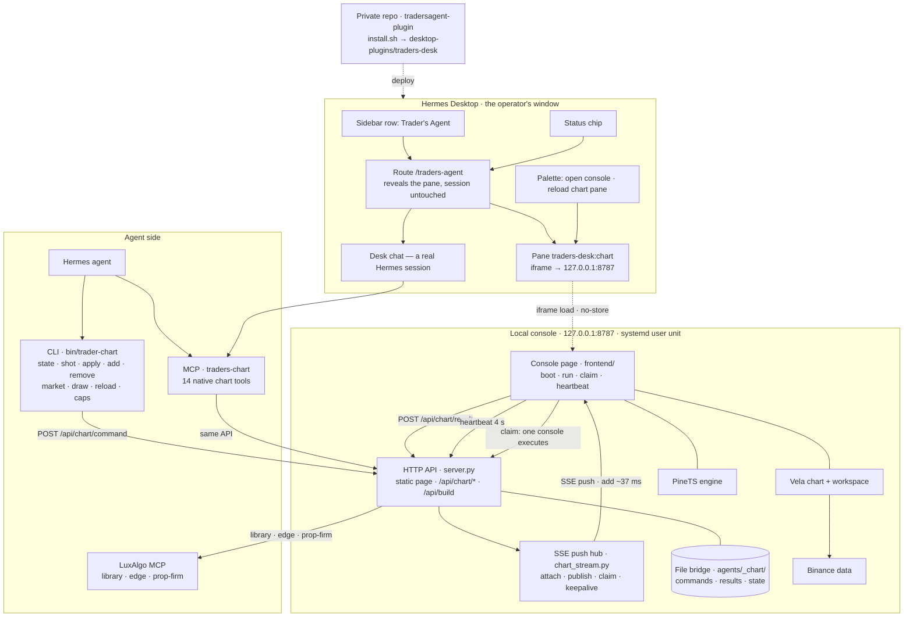

# HANDOFF — Trader's Agent (Hermes Desktop plugin + local Vela console)

**Written for:** an outside agent/model picking this up cold (no access to the chat that built it).
**Written by:** the previous agent session, 20 Sep 2026, repo `godzillacode0000/tradersagent-plugin` @ `369a949` (this file lives at `docs/HANDOFF.md`; bump the SHA when you ship).
**Operator:** one user, Malay/English speaker, runs a single laptop (Omarchy/Arch, 8 GB RAM), drives it
mostly from his phone over Telegram, wants short answers with commands explained plainly.

---

## 1. What this is

An **unofficial** Hermes Desktop plugin that puts a live **LuxAlgo "Vela" chart** beside the chat and lets
the agent (and the user) read and drive that chart with low latency. It is deliberately:

- **local-only** — a small Python stdlib server on `127.0.0.1:8787` serves the chart page; nothing is
  hosted, no accounts, no telemetry.
- **not affiliated with LuxAlgo** — never use their logo or wordmark; Vela and PineTS load from CDN, never
  vendored; Library Pine source is CC BY-NC-SA 4.0 and must **never** be committed (it may be fetched at
  runtime and drawn, with attribution).
- **MIT** for this plugin's own code.
- **private repo**, personal use. Grok cannot clone it; the operator will paste this file (and file
  contents) instead.

Goal in the operator's words: *"chart ni yang connect, communicate, see and understand the chart with the
lowest latency possible"* — chat on the left, chart docked on the right, agent drives the chart through
native tools.

---

## 2. Where everything lives

| Thing | Path / value |
| --- | --- |
| Plugin repo (source of truth) | `~/Projects/tradersagent-plugin` → `git@github.com:godzillacode0000/tradersagent-plugin.git` (private) |
| Deployed plugin | `~/.hermes/desktop-plugins/traders-desk/plugin.js` (byte-identical to repo, via `./install.sh`) |
| Live console app | `~/Projects/luxalgo-web` (served at `http://127.0.0.1:8787/`) |
| Service | user unit `luxalgo-web.service` → `ExecStart=~/Projects/luxalgo-web/start.sh --host 0.0.0.0` |
| File bridge (durable queue) | `~/Projects/luxalgo-web/agents/_chart/{commands,results,state}.json` |
| MCP server | repo `console/mcp/server.py`, registered in Hermes as `traders-chart` (uvx + fastmcp) |
| CLI | `~/Projects/luxalgo-web/bin/trader-chart` (mirrored to repo `console/bin/trader-chart`) |
| Desk chat session | the Hermes session titled *"Trader's Agent — desk"* (id lives in `console/agents/desk/index.json` on the live machine) |
| Layout preset the operator saved | `user-trader-s-agent-plugin` — 3 zones: `sessions` │ `workspace`(chat) │ `traders-desk:chart` |
| Plugin id / pane id | `traders-desk` / `traders-desk:chart` |
| Credentials (LuxAlgo MCP URL + tokens, GitHub) | `~/.hermes/config.yaml` — **never** commit, never print |

Versions at handoff: Hermes Desktop 0.21.3, console `SERVER_VERSION = 1.0.0`, CI green, 68 backend tests,
8 plugin contributions across 5 areas.

---

## 3. Architecture



Rendered versions live in the repo: `docs/architecture.html` (dark themed page) and `docs/architecture.mmd`
(source, paste-ready). A second diagram, `docs/pine-flow.*`, covers the Pine path.

### 3.1 The command path (the part that matters)

1. **Agent → console.** Either the MCP tools (`chart_state`, `chart_shot`, `chart_apply_pine`,
   `chart_add_indicator`, `chart_remove_indicator`, `chart_set_market`, `chart_draw`, `chart_clear`,
   `chart_caps`, `chart_views`, `library_search`, `library_indicator`) or the CLI
   (`state shot apply add remove market draw clear script mode reload caps wait`).
   Both POST to `http://127.0.0.1:8787/api/chart/command`.
2. **Server validates the action** against the list the *page* advertised in its last heartbeat
   (`state.json → actions`). A whitelist that lives only in the backend drifted once and produced
   "unknown action" with HTTP 200 — do not hardcode the list anywhere.
3. **Push, not poll.** `chart_stream.py` holds one long-lived SSE response per console page and writes the
   command the instant it exists (~single-digit ms). The page executes it, POSTs the result to
   `/api/chart/result`, and the waiting caller (CLI/MCP) returns that result in the same round trip.
   Fallback: the file bridge + a 2 s poll loop — a page that is not streaming still works, just slower.
4. **Exactly one executor.** Several console pages can be alive at once (the docked pane, a route page, a
   browser tab). Each asks `POST /api/chart/claim {id, viewer}` first; the first claimant executes, the rest
   report nothing. Commands marked `once_per_view` (a `reload`) are granted once to *every* viewer.
5. **Proof, not intent.** Every mutating action reads the artefact back and reports `before → after`
   (indicator list, overlay counts, market). Callers surface that string.

### 3.2 The heartbeat

Every console page POSTs `/api/chart/state` every 4 s: symbol, timeframe, last price, bars, `natives`
(the studies on the chart), drawings, `series`, `actions` (what this build can execute), plus
`build` (a stamp of the frontend files it loaded) and `viewer` (its random id). `/api/build` reports the
stamp the server is serving — when the two differ, that view is a **stale frame**, and that is how you
tell without guessing. (The server's state normaliser drops unknown fields, so new heartbeat fields must
be added to `chart_bridge.save_state` too — that cost an hour once.)

### 3.3 Theme coupling

Two separate themes exist: the console page's own palette (`data-theme` + `localStorage['luxalgo-web:theme']`)
and Vela's persisted `rendererConfig` inside `localStorage['vela-workspace']`. **A Vela theme *string* does
not rewrite a config that already holds explicit colours.** `frontend/chart-palette.js` therefore:

- parks a hand-made palette at script-load time (before Vela's modules rewrite storage),
- applies the console's palette with `rendererControl.applyConfig(...)`,
- re-asserts it a bounded number of times after boot and on return-to-visible (Vela restores its stored
  config at moments we do not control),
- restores the parked palette when the console is switched to light.

The `palette` action reports what the chart is actually wearing, and `palette {try:true}` reports what an
explicit apply leaves behind 300 ms later.

---

## 4. Component reference

**Plugin (`plugin/plugin.js`, one file, ~660 lines, no JSX — it uses `jsx()`/`jsxs()` runtime calls):**

| Contribution | Area | What it does |
| --- | --- | --- |
| `page` | `routes` | landing `/traders-agent`: reveals the chart pane, leaves the current session alone |
| `chart` | `panes` | the chart itself, docked right of the conversation (`PANES_AREA`), iframe on `APP_URL` |
| `nav` | `sidebar.nav` | the "Trader's Agent" row (order 40) |
| `chip` | `statusBar.right` | status chip, click opens the console |
| 4 commands | `palette` | open console · **reload the chart pane** · toggle auto-reveal · open in browser |

Notable behaviour: the pane remounts itself when it is revealed after being hidden (a renderer keeps its
last painted frame while occluded, and a frozen page cannot act on the console's own reload command), and
the palette command `Trading: reload the chart pane` remounts on demand. `revealPane()` can report success
while the pane stays hidden if the app's layout zone is minimised — the landing page asks twice and shows a
short note with the way out instead of failing silently.

**Console backend (`console/backend/`, Python stdlib only):**

| File | Role |
| --- | --- |
| `server.py` | HTTP server: static `frontend/`, `/api/*` routes (19 endpoints), SSE stream route, CORS reflected for loopback origins, `/api/build` |
| `chart_stream.py` | the SSE hub: attach/detach, keepalive 8 s, publish, `claim()` (one executor / once-per-view), result registry, stats |
| `chart_bridge.py` | the file bridge: commands/results/state on disk, action validation, screenshot decode, `save_state` normaliser |
| `agents_store.py`, `chat.py` | per-agent state/notes and the local chat helper used by the console's own panels |
| `mvp_server.py` | legacy early prototype — check before assuming it is dead code |

**Console frontend (`console/frontend/`, plain scripts, no bundler):**

| File | Role |
| --- | --- |
| `index.html` | page skeleton; loads CDN shims, `chart-palette.js`, then `workspace.js` (ESM) and `app.js` |
| `workspace.js` | builds the Vela workspace from CDN (`@luxalgo/vela/workspace` + Binance provider + `vela-pinets`), parks the palette before construction |
| `app.js` | boot (workspace or bare chart), theme, panels/Library/Details UI, log |
| `chart-bridge.js` | the agent-facing page: heartbeat, command execution, claim, SSE + poll, `shot`, `palette`, `remove`, `probe` |
| `chart-palette.js` | the palette park/apply/enforce rules described above |
| `overlay.js` | our drawing layer (boxes/lines/labels/tables) that `draw` paints onto |
| `pinets-runner.js`, `pinets-layer.js` | PineTS execution + the native paint layer |
| `styles.css` | console chrome, responsive top row (clip-proof from ~500 px to 1280 px pane width) |

**MCP server (`console/mcp/server.py`)** — 14 tools (`chart_views`, `chart_caps`, `chart_state`,
`chart_shot`, `chart_apply_pine`, `chart_draw`, `chart_clear`, `chart_add_indicator`,
`chart_remove_indicator`, `chart_set_market`, `chart_reload`, `chart_palette`, `library_search`,
`library_indicator`). Thin wrapper over the HTTP API. **Tools load at session start: after adding a
tool, the running session will not see it — start a new session or `/reload-mcp`.**

**CLI (`console/bin/trader-chart`)** — 14 subcommands; also `console/bin/library-indicator` (fetch one
Library indicator) and `console/bin/all-library-context-dependency.py` (Library analysis helper).

---

## 5. Measured API map — the traps that cost the most time

Full version: `docs/vela-chart-api-notes.md`. The essentials:

- **Removing a study:** the working door is the *ledger entry's own* `remove()` —
  `chart.indicators()` returns entries carrying `nativeType` (`macd`), `id` (`native-1`), `controller`.
  `cell.removeNative('macd')` **throws inside Vela**; `cell.removeInstance(id)` and
  `cell.removeFromChart(id)` **return cleanly and remove nothing**; the workspace state's
  `indicators.natives` is `[]` even while the chart carries studies. Never trust a clean return — read
  `presentNativeIndicators()` back.
- **Pine runs once per bar.** An unguarded `line.new` in a 500-bar run produced **50 lines and 50 labels**.
  Guard with `var bool drawn = false` / `if not drawn`, and draw at absolute bar coordinates (`0 → bars-1`)
  so a level spans the loaded window instead of trailing the last bar.
- **`apply` vs `draw`:** one landasan (frontend `window.TraderRun`) — geometry (boxes/lines/labels/tables)
  goes to our overlay with the state read back after drawing, plot series to a matching *Vela native*, and
  only when the script really plots. `draw` stays the explicit geometry door for levels like PDH/PDL;
  `apply`, the script pane and the Library all share the same run, so no door can claim it lacks a
  surface while drawing nothing.
- **PineTS is a subset:** no `import`, no `while`, no `for … in`. The Library's *Previous Highs & Lows*
  (the PDH/PDL indicator) **cannot run** for exactly this reason. Vela's own Pine engine is a paid feature
  and is not used. When a Library script hits the wall, compute the value from data and draw it.
- **Library source is licence-bound:** fetch at runtime (`/api/source?slug=…`), never commit it.
- **Stale frames:** compare the heartbeat's `build` with `/api/build`. A frozen/occluded frame executes
  nothing at all — no reload, no command — which is why the pane remounts on reveal.

---

## 6. Current status (verified at handoff)

Working, with evidence:

- Chart beside the chat; the operator's 3-zone layout is the app's **active** preset
  (`layoutPreset.active = user-trader-s-agent-plugin`; tree = `sessions` │ `workspace`+terminal │
  `traders-desk:chart`+review+files).
- All 14 MCP tools answer (`chart_reload` / `chart_palette` / `chart_remove_indicator` included).
  `chart_state` returns live data plus `build`/`viewer` when the page publishes them.
- `add ema` → `remove --all` → `chart now carries: nothing` (the new removal path, end to end).
- PDH/PDL drawn on demand: previous UTC day's high/low from Binance daily klines → `draw` →
  `2 line(s), 2 label(s)`, verified on screen.
- Latency: symbol switch **686–698 ms** end to end, screenshot **35 ms**, `clear` **7 ms**, SSE push
  single-digit ms (transport is not the bottleneck; the chart engine fetch+render is).
- Console health: `/api/health` ok, LuxAlgo MCP connected, 19 endpoints.
- 68 backend tests, plugin harness OK (8 contributions / 5 areas), CI green on `5b11678`.

Current live state (transient): chart on **SOLUSDT**, console theme **light** (so the chart matches it),
a hand-made palette parked; the docked pane may be hidden — check the heartbeat, not the screen.

---

## 7. Open problems — what to settle next (ranked)

1. **Real LuxAlgo indicators cannot run.** The catalogue's indicators (what the operator actually wants:
   "the LuxAlgo indicators I see on their site") are full Pine v6 scripts; PineTS rejects `for … in` and
   friends. Options to investigate, in order of user value:
   (a) a PineTS-compatible **port** of the specific indicators he names (subset-safe, no MTF calls);
   (b) compute-from-data drawings (the PDH/PDL pattern) for level-type indicators;
   (c) Vela's **paid Pine engine** — costs money, decide with the operator.
   Deliver each as "which route was taken", never as a claim that the Library script ran.
2. **Latency on symbol switches** (~0.7 s) is engine-bound: 500 bars fetched + re-render. Ideas: a small
   market cache/warm-up, fewer bars for quick switches, or pre-fetching the next symbol. Measure before
   and after; the operator tracks numbers.
3. **Layout on plugin open.** The plugin **cannot** apply a layout: the plugin SDK has no apply door
   (`layout.apply` is agent-side only), and a plugin-contributed layout preset does **not** appear in the
   layout dialog in this build. Current guarantee = the app's active preset + `apply_layout` by the agent.
   If "every open lands in the 3-zone layout" must be airtight, that needs an app-side hook, not a plugin
   trick — say so instead of faking it.
4. **Theme default.** Mechanics are done; the *default* (light vs dark console, and therefore chart) is the
   operator's taste call. He may also want the parked hand-made palette honoured on a fresh machine.
5. **Frozen/occluded frames.** Mitigated (remount-on-reveal, palette command, build stamps) but the class
   of bug remains: any new feature must assume a page may be frozen and must be verifiable from the
   backend (heartbeat/heartbeat-build/result files), never from a screenshot alone.
6. **Repo hygiene:** `__pycache__` is gitignored. `mvp_server.py` is the `--mvp` fallback in
   `console/start.sh` only — the live unit runs `server.py`. Error toasts now point at `start.sh`,
   not the prototype. Sync live console with `./tools/sync-live.sh`. `./install.sh --doctor` checks
   interpreter, port, unit, plugin folder.
7. **Docs drift is guarded by CI** (`test_docs_drift.py` compares `docs/plugin-catalog-entry.yaml` with the
   MCP server's tools): adding/removing a tool without updating the entry turns CI red. Keep that in mind
   when you touch tools.
8. **Pushing red is easy to miss:** run the suite **without piping** (`python3 -m unittest discover -s
   console/backend/tests -t console/backend/tests`) and read the verdict; a `| tail` hid a `FAIL` once and a
   red CI was pushed.

---

## 8. How to work on this (dev loop, verified)

```bash
# 1. edit in the repo (source of truth) or in the live app dir, then mirror:
cp ~/Projects/luxalgo-web/frontend/*.js  ~/Projects/tradersagent-plugin/console/frontend/
cp ~/Projects/luxalgo-web/backend/*.py   ~/Projects/tradersagent-plugin/console/backend/
cp ~/Projects/luxalgo-web/bin/trader-chart ~/Projects/tradersagent-plugin/console/bin/

# 2. prove it locally — never pipe the suite
cd ~/Projects/tradersagent-plugin/console/backend
python3 -m unittest discover -s tests -t tests -p 'test_*.py'
cd ~/Projects/tradersagent-plugin && node tools/verify-plugin.mjs plugin/plugin.js   # bare, no pipe

# 3. console (frontend) changes: reload the page — every view, not just one
~/Projects/luxalgo-web/bin/trader-chart reload
#    plugin (plugin.js) changes need a plugin reload in the app: Ctrl+K → "Reload desktop plugins"
#    MCP changes need a NEW session (tools load at session start)

# 4. commit + push; CI must be green
git add -A && git commit -m "…" && git push && gh run list --limit 1
```

Verification cookbook (anything you claim, prove like this):

```bash
bin/trader-chart state                     # what the chart shows right now
bin/trader-chart caps                      # what this page can execute
bin/trader-chart shot --out /tmp/x.png     # PNG for vision
bin/trader-chart add ema / remove --all    # mutation + read-back in one line
curl -s localhost:8787/api/build           # what the server serves (compare to heartbeat build)
curl -s localhost:8787/api/chart/stream/status   # views attached, pushes, claims granted/refused
python3 - <<'PY'                           # a `palette {try:true}` probe shows what the chart wears
import json,urllib.request
req=urllib.request.Request('http://127.0.0.1:8787/api/chart/command',
  data=json.dumps({'action':'palette','try':True}).encode(),
  headers={'Content-Type':'application/json'},method='POST')
print(json.loads(urllib.request.urlopen(req,timeout=30).read()))
PY
```

Do **not**: commit Library Pine source; add LuxAlgo branding; add any trade execution/order path (this is
read/style/draw/compute only); print or commit credentials from `~/.hermes/config.yaml`; hardcode the
page's action list in the backend; assume a clean API return means the chart changed.

---

## 9. Glossary

- **Vela** — LuxAlgo's charting library (loaded from CDN). **PineTS** — the open Pine-subset engine used
  here; **the full TradingView/Vela Pine engine is paid and unused.**
- **Console** — the local page + server at `127.0.0.1:8787` that hosts the chart.
- **Pane** — the app's dockable surface; the chart lives in `traders-desk:chart`.
- **Bridge action** — one command the console page knows how to execute (`add`, `remove`, `apply`, `draw`,
  `clear`, `market`, `shot`, `reload`, `mode`, `script`, `palette`, `probe`).
- **Claim** — the server-side decision of which console view executes a command (one executor; or one per
  view for `once_per_view` commands).
- **Ledger** — `chart.indicators()`: the list of studies actually mounted, the only reliable source for
  what is on the chart.
- **Heartbeat** — the page's 4 s status POST; carries `build` + `viewer`, which is how a stale frame is
  detected.
- **Desk chat** — the Hermes session that carries the chart tools and the study context.
